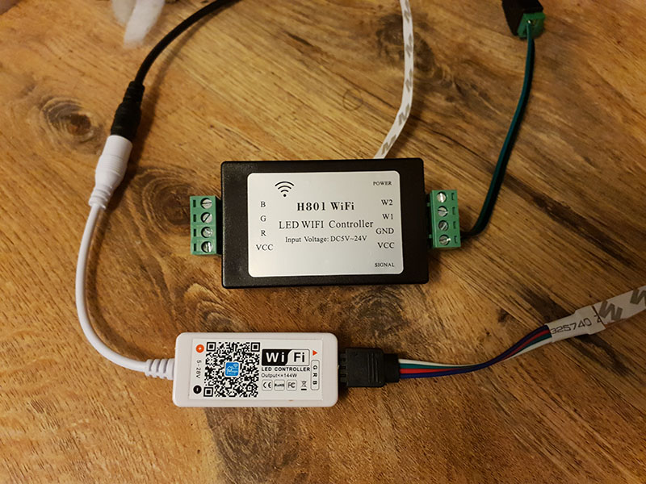
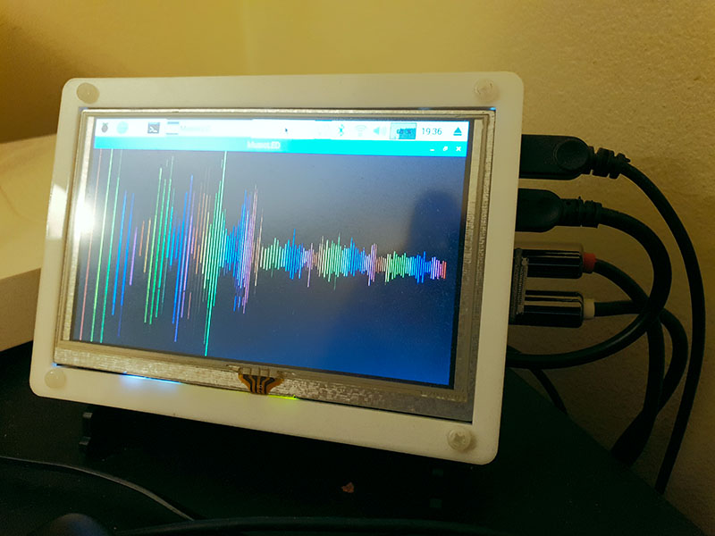
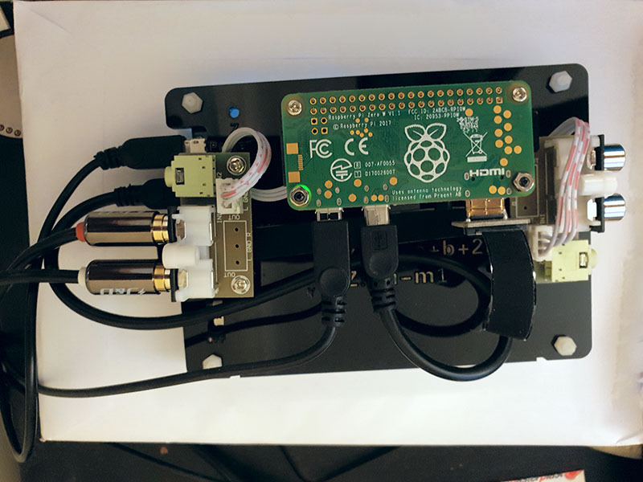

# Music-Driven WiFi LED Strip Visualizer

Simple (like, really simple) Linux program that takes audio input from ALSA and sets an LED strip color in sync with the music.

## Overview

The idea is pretty common: take audio input stream (using ALSA), put it through FFT (using [FFTW](http://www.fftw.org/)), take the "loudest" frequency (trivial), assign a color to it (using [Chromatic scale](https://en.wikipedia.org/wiki/Chromatic_scale), with all [12 notes](https://www.youtube.com/watch?v=IT9CPoe5LnM)), send that color to a WiFi-controlled LED strip or a few (I'm using controllers flashed with [ESPurna](https://github.com/xoseperez/espurna)).

Now, do all that, and also visualize the audio spectrum, 60 times per second, on a Raspberry Pi Zero W.


OK, maybe it's not that impressive, but it sure is fun, and makes a good Christmas tree decoration that blinks in sync with your festive tunes, or a good party lighting if you happen to have some LED strips in your room, like I do.

## My Setup

The main use case for me is: there's a device that plays music (it could be a home theater receiver, or just the speakers plugged into my desktop PC), and by plugging a Raspberry Pi-based device into it (using a splitter cable or the "Zone B" feature) I can process that music and control the WiFi LED strip. The LED WiFi controller here is irrelevant: I have H801 and MagicHome ones, both flashed with ESPurna firmware, and both working equally well.



The device I use to achieve my goal is more interesting: it's a Raspberry Pi Zero W bundled with an [AudioInjector Zero](https://www.kickstarter.com/projects/1250664710/audio-injector-zero-sound-card-for-the-raspberry-p) sound card and a [Waveshare 5-inch HDMI display](https://www.waveshare.com/5inch-hdmi-lcd-b.htm) connected to it. Fairly cheap setup that allows me to use music lights with any audio source. This program, though, should work just as well on any other Linux-based computer, ideally the one playing that music in the first place to avoid DAC-to-ADC double conversion.





## Dependencies

Install the necessary libraries and tools by running:
```
sudo apt-get install libx11-dev libasound-dev libfftw3-dev libcurl4-openssl-dev gcc build-essential
```

## Running

After running "make" command, the application is started with a command like:
```
DISPLAY=:0 ./musicled <hostname> <API key>
```

Adding "DISPLAY=:0" is optional, it is only needed when you run it from an SSH shell, like I do.

For example:
```
DISPLAY=:0 ./musicled ESPURNA-DDC430 B9110C0303D3A5B7 ESPURNA-4BD512 527877A979AFE2A2
```

If there is no display to be found (or "DISPLAY=:0" is omitted when running from SSH shell), it starts in a headless mode, using less CPU.

When the application is running, either press Ctrl+C in the console, or press 'q' on the keyboard that's connected to the device.

## Not Implemented

Things that could be added or improved (feel free to contribute!):

* Command line usage hint;
* PulseAudio support (should be easy to make a drop-in replacement class);
* Config file support (at least to choose the input device);
* Multi-color / addressable LED strip support;
* Support for MQTT, UDP, other controllers or firmwares;
* Wider range of input formats (e.g. floating point samples);
* etc.

## Analysis Quality vs. Performance

The constants used for audio analysis itself are somewhat opinionated: I listened to a lot of tracks and watched the lights blink, then only left the range of octaves 3 to 8. Since the FFT works in a way that the number of samples grows exponentially with every added octave, fitting too many octaves makes little sense. The lower ones were discarded because in most cases they only represent bass beats, not the actual melody, and require a wider sample window to analyze, which in turn leads to a bigger delay for visualization. I also made sure that the lowest octave will still get at least 6 notes reasonably represented.

So, the analysis settings were picked as 2048 samples per frame, discarding frequencies outside the [3-8] octave range, which translates into only using samples [6-388] of the 1023 FFT output frequencies (it takes around 389 samples *more* to represent octave 9, and octave 10 is incomplete anyway). These constants were picked for the quality of the resulting visualization and nothing else.

That said, it does help a to maintain the target performance: the delay between a note sound and the color change should be [within 80 ms](https://paulbakaus.com/tutorials/performance/the-illusion-of-speed/) to be perceived as immediate. So, with the audio input buffer of 256 samples, the FFT input buffer of 2048 samples, 44100 audio sampling rate, and 60fps "frame" rate, plus some network roundtrip, the delay is likely to stay under ((2048 + 256) / 44100 + 1 / 60) = 69ms (plus network). The analysis and visualization code should be optimized enough to keep that speed up on a Pi Zero without taking up *all* of the CPU (it takes around 70% of it though).

## General Notes

The main audio capture and processing core are loosely based on the [CAVA](https://github.com/karlstav/cava) project.
