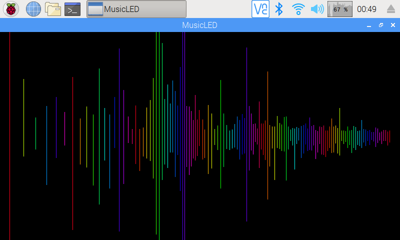

# Music-driven LED strip visualizer

Simple (like, really simple) Linux program that takes audio input from ALSA and sets an LED strip color in sync with the music.

## Overview

The idea is pretty common: take audio input stream (using ALSA), put it through FFT (using [FFTW](http://www.fftw.org/)), take the "loudest" frequency (trivial), assign a color to it (using [Chromatic scale](https://en.wikipedia.org/wiki/Chromatic_scale), with all [12 notes](https://www.youtube.com/watch?v=IT9CPoe5LnM)), send that color to an LED strip or a few (I'm using controllers flashed with [ESPurna](https://github.com/xoseperez/espurna)).

Now, do all that, and also visualize the audio spectrum. 60 times per second. On a Raspberry Pi Zero. In C++.

OK, maybe it's not that impressive, but it sure is fun, and makes a good Christmas tree decoration that blinks in sync with your festive tunes, or a good party lighting if you happen to have some LED strip in your room, like I do.

## Notes

I won't even deny that the main audio capture and processing core came to life thanks to the [CAVA](https://github.com/karlstav/cava) project. In my defense, I did make a meaningful [contribution](https://github.com/karlstav/cava/issues/211) to it, and I would only be happy if any part of this project were backported to the original one.
